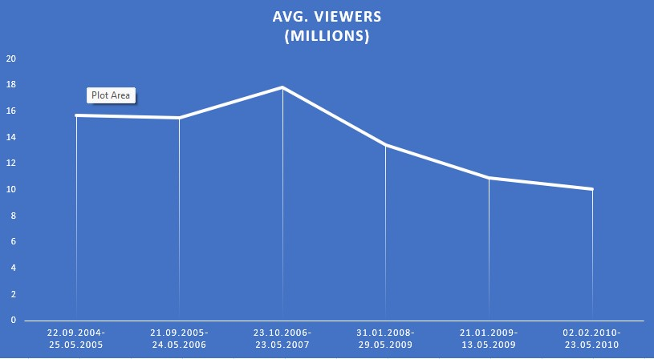

## Lost (2004 TV series)

*Lost* is an American science fiction adventure drama television series created by Jeffrey Lieber, J. J. Abrams, and Damon Lindelof that aired on ABC from September 22, 2004, to May 23, 2010, over six seasons and 121 episodes. It contains elements of supernatural fiction, and follows the survivors of a commercial jet airliner flying between Sydney and Los Angeles, after the plane crashes on a mysterious island somewhere in the South Pacific Ocean. Episodes typically feature a primary storyline set on the island, augmented by flashback or flashforward sequences which provide additional insight into the involved characters.

## Viewership Statistics

| Season           |Avg. viewers (millions) |Rank |
|------------------|------------------------|-----|
| 1                | 15.69                  |15	  |
| 2                | 15.50                  |15   |
| 3                | 17.84                  |10   |
| 4                | 13.40                  |17   |
| 5                | 10.94                  |28   |
| 6                | 10.08                  |31   |

## Viewership Over Time

## Analysis of Viewership Changes

The show had a stable viewership from Season 1 to Season 2, followed by a notable increase in Season 3. The average viewership of season three compared to season two increased by 2.34 million. Seasons four, five and six were losing popularity with average viewerships of 13.40, 10.94 and 10.08 respectively.